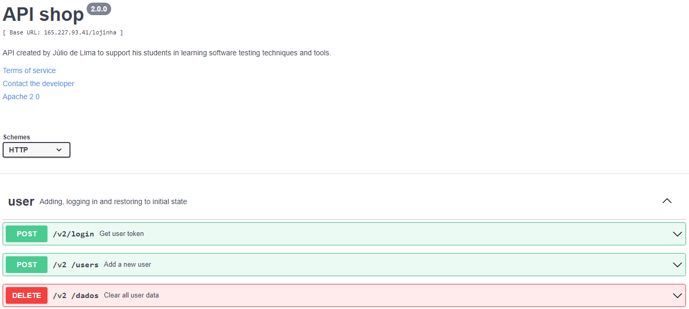
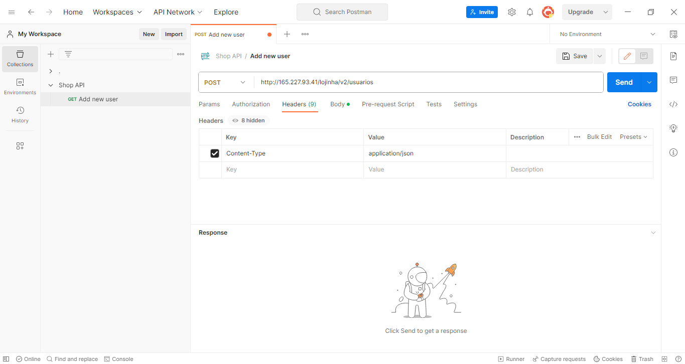
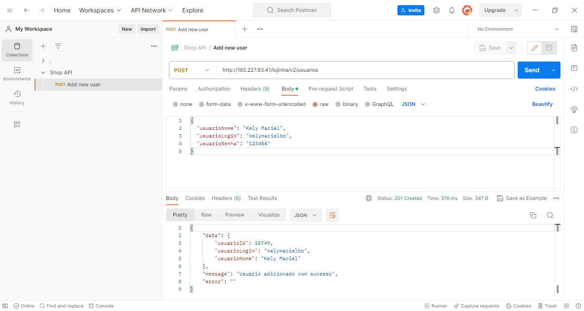

# API testing

## What is an API?
An API (Application Programming Interface) is a type of software implementation that allows exposing a backend application to the outside world without the need for access to its source code.

They can be implemented in various ways, one of them is by following an architecture called REST (Representational State Transfer).

The interface documentation of a REST API can be created in various formats. One of the most well-known formats is Swagger. Here we will use this documentation format. We will work using an application named "API shop". The documentation of this API can be found at http://165.227.93.41/lojinha/lojinha-v2.yml

Tips for testers: It is possible to identify errors during the Swagger analysis.

## Using postman to handle features

Postman is an API development tool which helps to build, test and modify APIs. https://www.postman.com/product/what-is-postman/

Using the API shop, we can insert a new user by setting up a POST HTTP method and the request "http://165.227.93.41/lojinha/v2/usuarios". We need to add Content-Type paramenter as "application/json" in header and configure the body of the request by selecting "raw" option and choosing "JSON". We insert the body content and click on "Send". Then, we've created a new user.

**Credits:** This content explores a subject based on the ideas and research of Julio de Lima. https://github.com/juliodelimas
